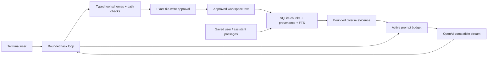

# SUN design and scope

## Paper mapping

The source paper is a trained sequential recommender ([primary text](https://arxiv.org/html/2606.09888v1)). Its sequence-length experiments concern 256–4096 interaction events. It does not validate a trillion-token LLM harness.

| Paper concept | SUN implementation | Equivalence limit |
| --- | --- | --- |
| Separate recurring memory from transitions | `memory.ts` durable chunk store; `harness.ts` bounded current task and recent whole turns | Application evidence and messages, not neural hidden state |
| Conditional reuse of stored patterns | FTS literal-term shortlist, relevance and diversity ranking, provenance IDs | Lexical retrieval; no learned residual VQ or code reinjection |
| Suppress redundant accumulation | Hash deduplication and overlap/source-diversity penalties | Storage/retrieval heuristic; no learned coverage gate |
| Memory-guided read/write purification | Limited retrieved excerpts and explicit evidence boundaries | No TDGD readout subtraction or matrix updates |
| Efficient long-sequence model | Small per-request active prompt, bounded candidate ranking in JavaScript | SQLite costs grow with index; no linear-time model scaling claim |

No output is labeled a faithful SinkRec implementation. API requests do not preserve `past_key_values` or neural checkpoints. The backend controls its own native state, model code, tokenizer and serving limits.

## Implemented storage and retrieval

SQLite uses WAL, transactions, FTS5 and content hashes. The database retains every source occurrence separately from unique content. Re-ingesting a file replaces its source snapshot and drops chunks that no remaining source references. Successful turn archives use unique immutable source IDs. Session JSON files keep recent complete turns and use atomic replacement. `/new` resets the working conversation; it leaves the external archive available.

Stored passages normalize line endings and Unicode to NFC while preserving indentation and line structure. Queries are normalized into at most twelve literal terms. A bounded conjunction shortlist retrieves passages containing every term before per-term oldest and newest posting matches; these produce at most 208 candidates. All recall reads share one SQLite transaction snapshot. Ranking combines query coverage and FTS rank with penalties for lexical overlap, repeated source and neighboring chunks. This gives bounded application memory and lets old and recent evidence compete. It is approximate: middle matches can still be absent when conjunctions or partial matches exceed their shortlist, lexical synonyms can miss, and SQLite posting traversal has no constant-latency guarantee. Source snapshot semantics and payload token estimates are explicit.

The prompt keeps the user's current turn, complete selected history groups and up to eight retrieved passages. At most 30% of input budget is offered to recall. The current turn takes priority. UTF-8 bytes plus 1,024 framing units estimate input conservatively; output is reserved before the request. Every tool step repeats budgeting, tools disappear on the final step, and oversized requests stop with an actionable error. No silent claim of access to omitted context is made.

## Toward the 1T goal

This release is a local prototype. It has no configured hard corpus-token ceiling, which does not establish capacity. At roughly four UTF-8 bytes per token, a trillion tokens would require around four terabytes of payload before index/provenance overhead; the ratio is only an estimate. A single SQLite prototype has not been tested at that size.

Future work requires partitioned object storage, resumable streaming ingestion, corpus manifests/checksums, sharded indexes, routing and hierarchical summaries, exact tokenizer accounting, deletion/retention policy, consistency and recovery tests, and retrieval-quality evaluation. These are a roadmap, not shipped features. Benchmark disk cost, ingestion throughput, p50/p95 recall latency, source coverage, adversarial repetition and long-distance answer accuracy at increasing sizes before making scale claims. Native recurrent-state modification requires a separate validated backend/training project.

## Permission model

Backend responses are data. Only validated structured calls to a fixed tool list can execute. Prompt injection inside retrieved text has no authority to enable tools or approve writes. Native tool serialization is operator opt-in, since model template syntax does not validate a server parser. Every write has an exact-content approval with rejection as the default. Denied requests return data to the model; they are not retried through another executor. One-shot mode denies writes. No command tool exists.

Path checks and file identity rechecks block routine escapes and approval-time changes. They are not a process sandbox against a malicious concurrent local writer; use an isolated workspace when evaluating untrusted models. No project tests execute model-proposed source or commands.
